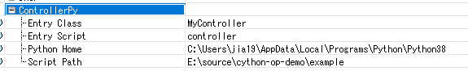

# OPSDN
[](https://pypi.org/project/opsdnpy/)

OPSDN is an enhanced SDN simulation framework for OPNET Modeler (Now Riverbed Modeler).

OPSDN unifies the event scheduling of the Ryu framework with OPNET's DES(Discrete Event Simulation) engine to solve the unmatched simulation speed when using SITL gateway. And it provides Ryu-like APIs for controller developing.

# Platform
Currently our software works on the following environment:
- OS: Window
- Compiler: MSVC x64
- OPNET: 18.6.1 (Note: there are some bugs in its openflow module. Contact me if you need more details.)
- Python: 3.8

Other platform may need more efforts. If someone would like to make some contributions, I will be more than happy to see you.

# Installation
There are 3 parts of this project: OPNET models, DLL bridge and opsdnpy.

Prebuilt binary of OPNET models and DLL bridge is provided for Riverbed Modeler 18.6.1 on the release page.

You could install opsdnpy using the pip command in your Python environment:
```
pip install opsdnpy
```

# Node Model Configurations

The sdn_controller_ethernet_wkstn_adv node model has several configurations in the `ControllerPy` section:
- Python Home: The location where your python installed. Currently virtual env is **not** supported.
- Script Path: The directory where your controller script locates.
- Entry Script: Your controller script name, without `.py`
- Entry Class: The controller class name in your controller script.

Configuration example shown below:


# API
See [OPSDN-API](./docs/opsdnpy-apis.md) for detailed api of opsdnpy.

# Examples

We provides two controller examples in the `src/opsdnpy/example` folder:
- simple_switch.py: a simple switch script modified from the Ryu standard simple_switch13.py.
- controller.py: a basic controller containing TopologyDiscover and FattreeForward, using LLDP for topology discover and using networkx for calculating forward path.

# Tutorial

We provide a tutorial for simple switch simulation in the examples. [Link](./docs/tutorial.md)
