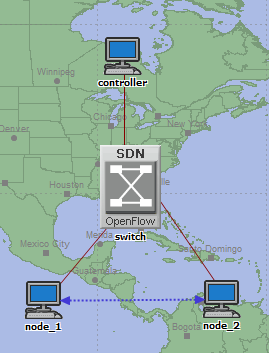
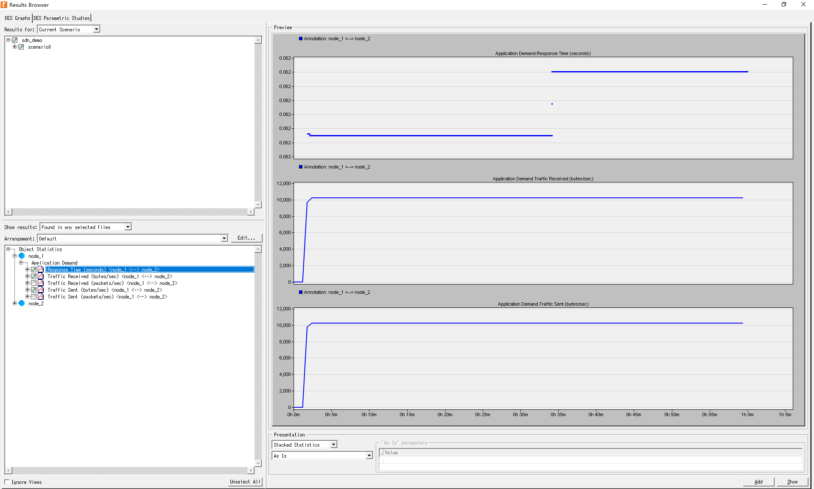

# Functionality Check manual

This manual aims to provide a user guide for testing the features provided by this software.

<!-- omit in toc -->
## Table of Contents

- [Prerequisite Requirements](#prerequisite-requirements)
- [Installation](#installation)
- [Basic Workflow Test](#basic-workflow-test)
- [Common API Test](#common-api-test)
  - [`@controller_app` and `@set_ev_handler`](#controller_app-and-set_ev_handler)
  - [`opsdn.sim_time()` and `OpTimer.set_op_timer()`](#opsdnsim_time-and-optimerset_op_timer)

## Prerequisite Requirements
1. OS version: Windows 7 or newer
1. Compiler: Microsoft Visual Studio 2010 (Recommended by Riverbed Modeler)
1. OPNET(Riverbed) Modeler 18.6.1
1. Python 3.8 with `Python38.dll` included in the `PATH` environment variables

## Installation
### Steps:
1. Install `opsdnpy`：
```bash
pip install opsdnpy
```

2. Download the prebuilt binary file from this link (https://github.com/ZacharyJia/opsdn/releases/download/v0.2.1/opsdn-prebuilt-vs2019-x64-v0.2.1.zip) and unzip it.
3. Create a new folder named "opsdn" and place the files `library.h`, `opsdn.dll`, and `opsdn.lib` into it. Then add the full path of this folder to the `include`, `path`, and `lib` environment variables.
4. Copy all remaining files in the prebuilt folders to the `op_models` directory in the user's home directory.

## Basic Workflow Test
### Steps:
1. Create a new opnet project and scenario.
2. Add nodes (a sdn_controller_ethernet_wkstn_adv, a of_switch_eth4 and two ethernet_wkstn_adv) to your scenario, and connect them like the following figure.



3. Save the example controller file [simple_switch.py](https://github.com/ZacharyJia/opsdn/blob/master/src/opsdnpy/examples/simple_switch.py) to your local folder.

4. Right click the node and click [Edit Attributes] to configure node attributes. The configurations are as follows:
- [controller]-[IP]-[IP Host Parameters]-[Interface Information]-[Address] => `192.168.100.1`
- [controller]-[ControllerPy]-[Python Home] => Your Python3.8 home
- [controller]-[ControllerPy]-[Script Path] => folder of simple_switch.py
- [controller]-[ControllerPy]-[Entry Script] => `simple_switch`
- [controller]-[ControllerPy]-[Entry Class] => `MyController`
- [controller]-[ControllerPy]-[OpenFlow Port] => `998`
- [switch]-[IP]-[IP Host Parameters]-[Interface Information]-[Address] => `192.168.100.2`
- [switch]-[Port To Controller] => Usually P0, but you should check by right click the link between controller and switch.
- [switch]-[Controller IP Address] => `192.168.100.1`
- [switch]-[Controller TCP Port] => `998` (This must lower than 1024, or will raise some bug due to OPNET's TCP design)

5. Add an `application demand` between node_1 and node_2, configure some traffic. For example:
- [Request Parameters]-[Size] => exponential(256)
- [Request Parameters]-[Rate] => exponential(3600)
- [Transport Protocol] => TCP

6. Right Click the scenario, click [Choose individual DES statistics]. Check the [Node statistics]-[Application Demand].

7. Press Ctrl+R to run the simulation.

8. After run the simulation, right click the scenario and choose [view results].
Check the checkboxes in [node_1]-[application demand] and see the results like in the following figure.

### Results:



## Common API Test
Here we will test the common APIs provided by OPSDN. 

Note: `Datapath.send_msg()` has been verified in the `add_flow` function in `simple_switch.py`, so we don't need to test it again.


Create a new python file `test_app.py` in the same folder of simple_switch.py, and we will add some code here to test the APIs.

### `@controller_app` and `@set_ev_handler`:
Steps:
1. Write code in `test_app.py`:
```python
import logging

import ryu.ofproto.ofproto_v1_3_parser as ofp13
from opsdnpy.app import controller_app, set_ev_handler


@controller_app
class TestApp:
    def __init__(self):
        self.logger = logging.getLogger('TestApp')

    @set_ev_handler(ofp13.OFPSwitchFeatures)
    def switch_features_handler(self, dp, msg):
        self.logger.debug(msg)
```

Here we create a new controller_app named TestApp, and add a `switch_features_handler` function to handle the `ofp13.OFPSwitchFeatures` message.

2. Add this app to the controller:
in `simple_switch.py`:
```Python
class MyController(Controller):
    def __init__(self):
        super(MyController, self).__init__()
        self.appManager.apps.append(SimpleSwitch13())
        self.appManager.apps.append(TestApp()) # this line will add TestApp to the controller as a new app.
```

Results:
3. Run the simulation and see the output. You will see a line like this:
```
DEBUG:TestApp:version=0x4,msg_type=0x6,msg_len=0x20,xid=0x98a91b80,OFPSwitchFeatures(auxiliary_id=0,capabilities=11,datapath_id=0,n_buffers=0,n_tables=4
```
This is a log from TestApp and print the SwitchFeature message from the OpenFlow switch.

This demontrates that these two wrapper `@controller_app`and `@set_ev_handler` will make a Python class an controller app and able to handle openflow messages.

### `opsdn.sim_time()` and `OpTimer.set_op_timer()`
Steps:
1. Modify the `test_app.py`, add some code like this:
```Python
import logging

import ryu.ofproto.ofproto_v1_3_parser as ofp13
from opsdnpy.app import controller_app, set_ev_handler

# new imports
from opsdnpy.op_timer import OpTimer
import opsdn # this might be marked as error in the IDE, but we just ignore it.

@controller_app
class TestApp:
    def __init__(self):
        self.logger = logging.getLogger('TestApp')

    @set_ev_handler(ofp13.OFPSwitchFeatures)
    def switch_features_handler(self, dp, msg):
        self.logger.debug(msg)
        OpTimer().set_op_timer(opsdn.sim_time() + 1, self.periodical_call, 1) # this line will set a timer, and will call periodical_call after 1 second.

    def periodical_call(self, user_data):
        self.logger.debug('periodical_call: user_data %d' % user_data) # print the user_data from last call
        OpTimer().set_op_timer(opsdn.sim_time() + 1, self.periodical_call, user_data + 1) # set a new timer to call this again after 1 second
```

Results:
Run the simulation again, and you will see the following lines in the output:
```
DEBUG:TestApp:periodical_call: sim_time: 11.238034, user_data 1
DEBUG:TestApp:periodical_call: sim_time: 12.238034, user_data 2
DEBUG:TestApp:periodical_call: sim_time: 13.238034, user_data 3
DEBUG:TestApp:periodical_call: sim_time: 14.238034, user_data 4
......
DEBUG:TestApp:periodical_call: sim_time: 3598.238034, user_data 3588
DEBUG:TestApp:periodical_call: sim_time: 3599.238034, user_data 3589
```

This demonstrates that the `sim_time()` will return the simulation time and `set_op_timer` is able to call a python function as the preset simulation time.
