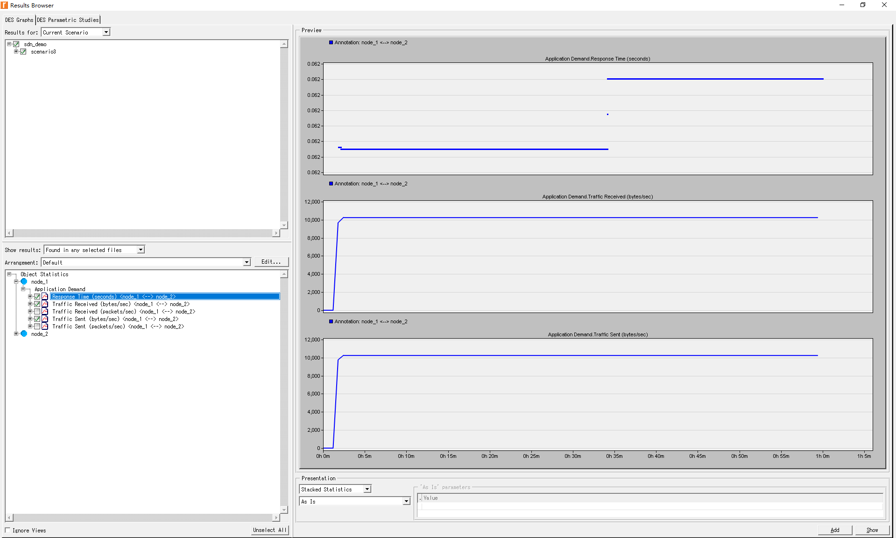

# Tutorial 

Here we provide the steps for the simple switch simulation:
1. Create a new opnet project and scenario.
2. Copy all the opnet models to your `op_models` folder.
3. Add some environment variables:
    - folder of opsdn.dll => PATH
    - folder of Python38.dll => PATH
    - folder of opsdn.lib => LIB
4. Restart your OPNET modeler for new environment variables to take effect. 
5. Add nodes (a sdn_controller_ethernet_wkstn_adv, a of_switch_eth4 and two ethernet_wkstn_adv) to your scenario, and connect them like the following figure.

6. Configure nodes attributes as follows:
- [controller]-[IP]-[IP Host Parameters]-[Interface Information]-[Address] => `192.168.100.1`
- [controller]-[ControllerPy]-[Python Home] => Your Python3.8 home
- [controller]-[ControllerPy]-[Script Path] => folder of simple_switch.py
- [controller]-[ControllerPy]-[Entry Script] => `simple_switch`
- [controller]-[ControllerPy]-[Entry Class] => `MyController`
- [switch]-[IP]-[IP Host Parameters]-[Interface Information]-[Address] => `192.168.100.2`
- [switch]-[Port To Controller] => Usually P0, but you should check by right click the link between controller and switch.
- [switch]-[Controller IP Address] => `192.168.100.1`
- [switch]-[Controller TCP Port] => `998` (This must be 998, or will raise some bug due to OPNET's TCP design)
7. Add a application demand between node_1 and node_2, configure some traffic. (Note: other traffic model like ip_traffic_flow might fail because OPNET don't sent PacketIn message)
8. Choose DES statistics for application_demand.
9. Run simulation and see results.
